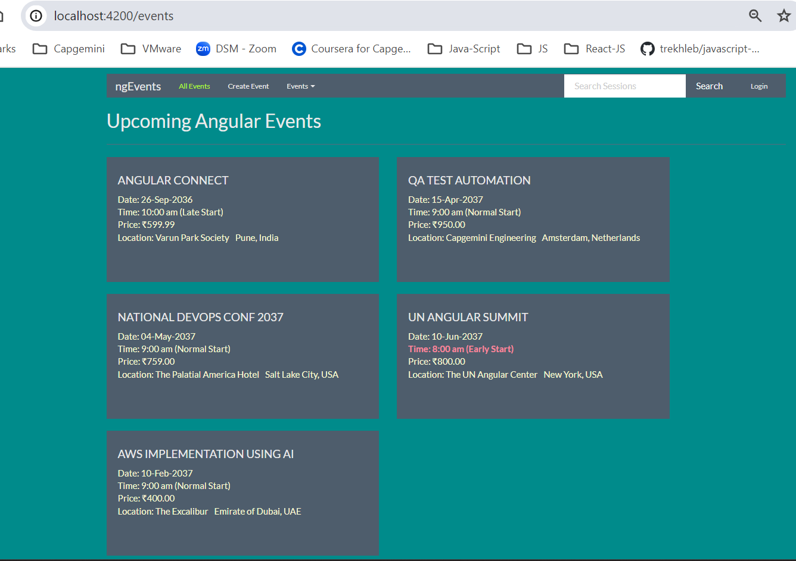
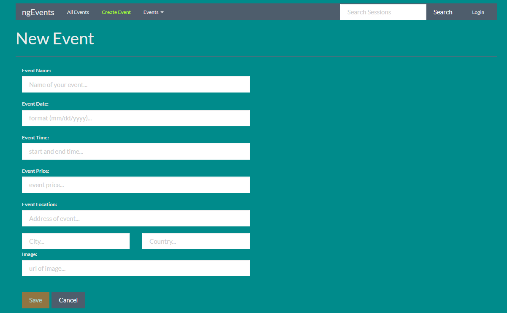
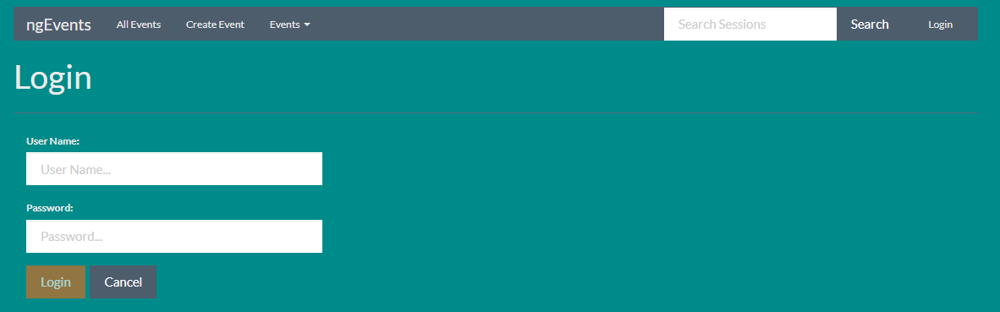
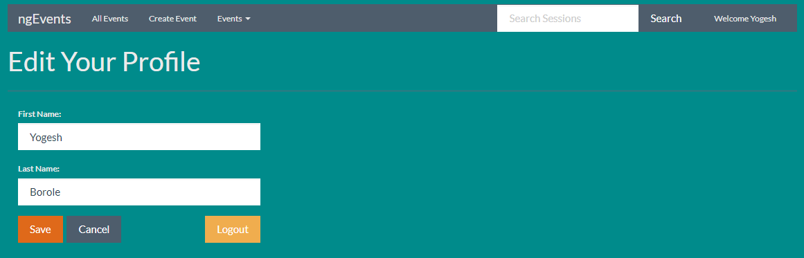
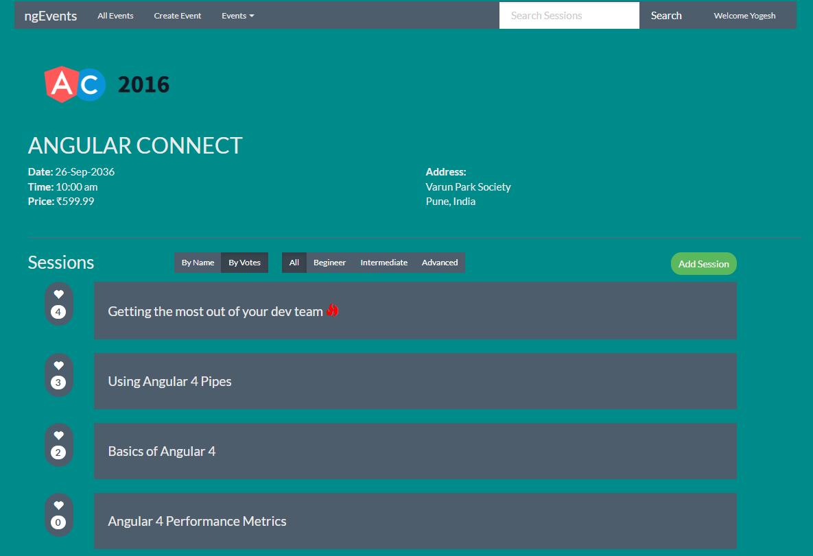
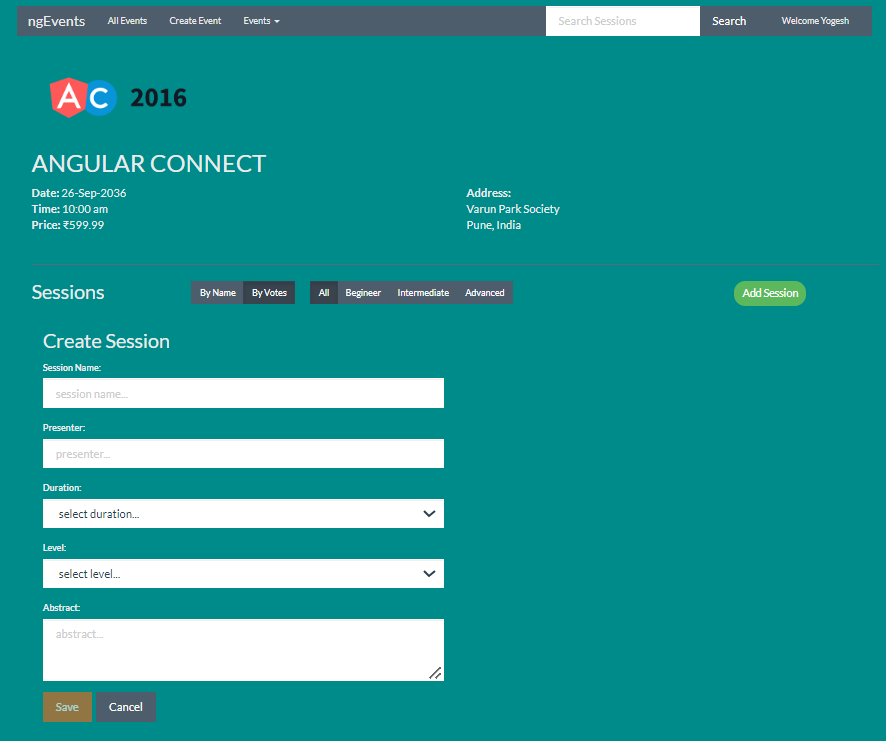
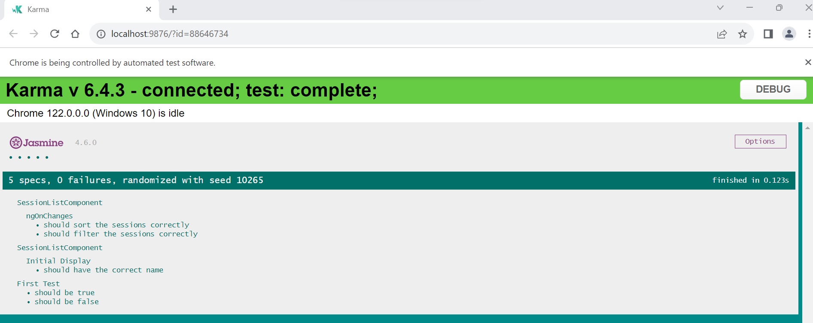

# ◼️Angular-11-Fundamental :

This project was generated with [Angular CLI](https://github.com/angular/angular-cli) version 16.1.8.

## Development server

Run `ng serve` for a dev server. Navigate to `http://localhost:4200/`. The application will automatically reload if you change any of the source files.

## Code scaffolding

Run `ng generate component component-name` to generate a new component. You can also use `ng generate directive|pipe|service|class|guard|interface|enum|module`.

## Build

Run `ng build` to build the project. The build artifacts will be stored in the `dist/` directory.

## Running unit tests

Run `ng test` to execute the unit tests via [Karma](https://karma-runner.github.io).

## Running end-to-end tests

Run `ng e2e` to execute the end-to-end tests via a platform of your choice. To use this command, you need to first add a package that implements end-to-end testing capabilities.

## Refer :

[Angular-11 Free Course : Jim Cooper & Joe Eames](https://app.pluralsight.com/library/courses/angular-fundamentals)

<a href="Angular-11-Fundamental-Notes.pdf" target="_blank">Refer Angular-11 Notes</a>

## UI Overview-Angular-App

1. Main Events Page :

   

2. Create Events Page :

   

3. Login Profile Page :

   

4. Update Profile Page :

   

5. Event Detail Page :

   

6. Create Session Page :

   

## Unit Tests Report

